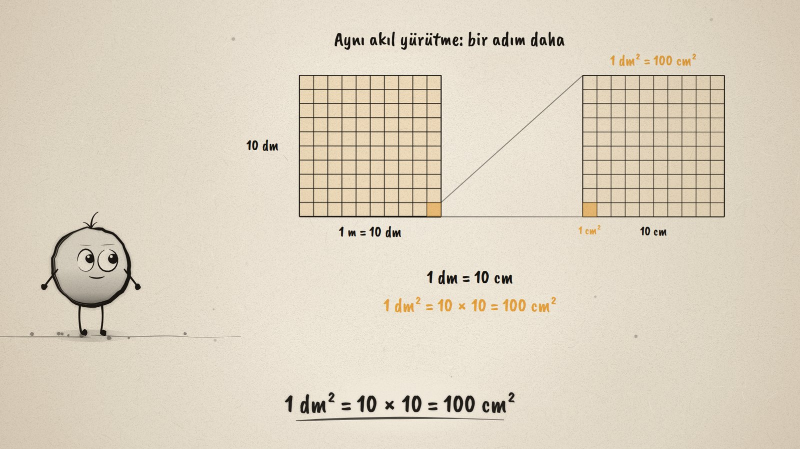
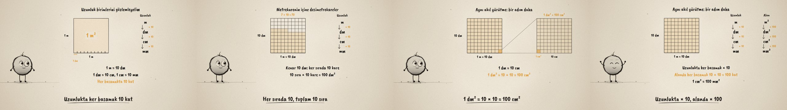

# Kare Metre · Units of Length and Area

**▶ Tarayıcıda izleyin / Watch in the browser:** https://hakanatas.github.io/kare-metre/ 
**⬇ MP4 + altyazılar / MP4 + subtitles:** [Releases](https://github.com/hakanatas/kare-metre/releases) 
**✎ Kullanılan istem / The prompt behind it:** [PROMPT.md](PROMPT.md) 
**🎞 Bütün filmler / All films:** [Nokta'nın Filmleri](https://hakanatas.github.io/nokta-filmleri/?sinif=6)

> **TR —** 6. sınıf matematik "Geometrik Nicelikler" temasındaki MAT.6.4.1 öğrenme çıktısı için hazırlanmış, tamamen JavaScript ile çizilen 92 saniyelik mürekkep animasyonu. 1 metrelik bir çubuktan kenarı 1 metre olan bir kare kuruluyor: 1 m². Önce uzunluk birimleri gözlemleniyor: çubuk 10 desimetreye ayrılıyor, m → dm → cm → mm merdiveninde her basamak 10 kat. Sonra metrekarenin içi desimetrekarelerle sıra sıra doluyor: 10 sıra × 10 kare = 100 dm². Aynı akıl yürütme bir basamak aşağıda deneniyor: bir desimetrekare büyütülüyor ve içine 10 × 10 = 100 cm² sığıyor. Uzunluk ve alan merdivenleri yan yana: uzunlukta her basamak × 10, alanda × 100. Çıkarım kullanılıyor: 3 m² = 300 dm², 2 500 cm² = 25 dm², 1 km² = 1 000 × 1 000 = 1 000 000 m². Altyazılar Türkçe, İngilizce ya da ikisi birlikte seçilebilir.

A 92-second ink animation for **6th-grade maths**, the first film of the fourth 6th-grade theme. Nokta, the ink character from [The Learning Ink](https://github.com/hakanatas/the-learning-ink), is the guide again. The analogy is carried by the drawing: the same `grid` (in `src/draw/film.js`) divides the square metre and the magnified square decimetre, and the two unit ladders are the same function with `× 10` and `× 100`.

## Learning outcome

MEB, Türkiye Yüzyılı Maarif Modeli, Ortaokul Matematik, 6th grade, "Geometrik Nicelikler" theme:

**MAT.6.4.1. Uzunluk ve alan ölçme birimleri arasındaki ilişkilerle ilgili analojik akıl yürütebilme**
- a) Uzunluk ve alan ölçme birimleri arasındaki ilişkileri gözlemler.
- b) Uzunluk ve alan ölçme birimleri arasındaki ilişkiyi tespit eder.
- c) Uzunluk ve alan ölçme birimleri arasında kurulan ilişkiden hareketle alan ölçme birimleri arasındaki ilişkiye dair çıkarım yapar.

## Scenes

| # | Time | Scene | What happens | Outcome |
|---|---|---|---|---|
| 1 | 0–10 s | Metre ve metrekare | A 1 m stick becomes the side of a 1 m² square. | a |
| 2 | 10–28 s | Uzunluk birimleri | 1 m = 10 dm; the ladder m, dm, cm, mm, each step × 10. | a |
| 3 | 28–46 s | Metrekarenin içi | The square fills with square decimetres: 10 rows × 10 = 100 dm². | b |
| 4 | 46–64 s | Analoji | One dm² magnified: 10 × 10 = 100 cm²; the length ladder (× 10) beside the area ladder (× 100). | b, c |
| 5 | 64–80 s | Çıkarımı kullan | 3 m² = 300 dm², 2 500 cm² = 25 dm², 1 km² = 1 000 000 m². | c |
| 6 | 80–92 s | Aklında kalsın | Side × 10, area × 100. | c |

## Running it

- **Preview:** double-click `index.html` (it works offline).
- **MP4:** run `npm install` once, then `npm run export -- --format=horizontal --captions=tr`.
- **Subtitles and narration:** `npm run srt` writes `out/captions_*.srt` and `narration_notes.txt`.
- **Editing:**
  - Caption text, timings and narration notes: `captions.js`
  - Everything on screen is drawn by `LI.world(t)` in `scenes/scene1.js` (the square, its grid, the magnified tile, the ladders, the words); the other scenes only set the camera.
  - The grid, square, unit ladder and Nokta's poses: `src/draw/film.js`; layout for 16:9 and 9:16: `src/draw/kd.js`

It uses the same engine as The Learning Ink: `renderFrame(t)` as a pure function of time, seeded randomness, and frame-by-frame export.
